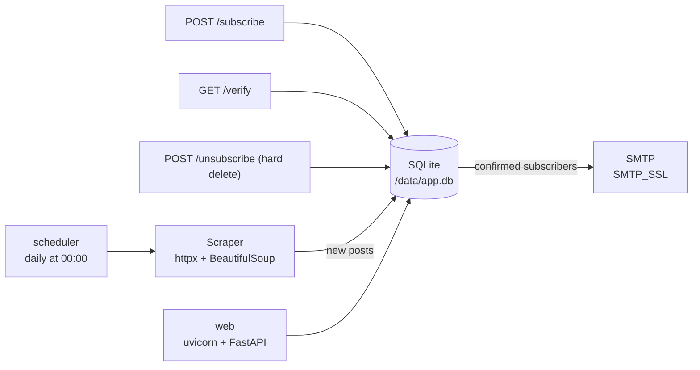

# sd-agh-edu-pl-mailer

A small, private service that watches
[`sd.agh.edu.pl/aktualnosci`](https://sd.agh.edu.pl/aktualnosci) for new posts and
e-mails each new post to subscribers, plus a tiny HTML frontend for
**verified** sign-up and **hard-delete** unsubscribe.

> **This is a private project.** It is independent and is **not part of AGH
> systems**; it is not an official channel of the AGH Doctoral School.

---

## What it does

- **Daily watcher** — runs once a day at 00:00 (Europe/Warsaw), scrapes the
  paginated news listing, reads each post's publication date, and detects posts
  newer than the last processed watermark. Midnight is deliberate: posts only
  carry a date (no time), so by then every post from the previous day is present.
- **Light on the AGH servers** — paging walks from the newest page backwards and
  **stops as soon as a page brings no new posts**, instead of loading the whole
  archive every time. A steady-state check fetches a single page.
- **Idempotent** — a `seen_posts` table keyed by URL guarantees a post is
  e-mailed **at most once**, ever. The first run seeds state instead of
  flooding inboxes with the whole archive.
- **Per-post e-mail** — subject and `<h1>` are the post title, followed by the
  post body, a link to the original, and a footer with the private-project
  notice and an unsubscribe link. Sent as `multipart/alternative`
  (plain-text + HTML).
- **Verified sign-up** — a signed, expiring, single-use link must be clicked
  before the address becomes active.
- **Hard-delete unsubscribe** — the subscriber row is physically removed.

## Architecture



Two containers share one SQLite volume:

| Service     | Command                              | Role                       |
| ----------- | ------------------------------------ | -------------------------- |
| `web`       | `uvicorn app.web:app`                | HTML frontend + API        |
| `scheduler` | `python -m app.watcher`              | daily detection + e-mail   |

## Quick start (Docker)

```bash
cp .env.example .env      # then edit .env with real SMTP credentials
docker compose up --build
```

- Frontend: <http://localhost:8000>
- Health:    <http://localhost:8000/healthz>

On the **first** scheduler run the archive is registered as "seen" and the
watermark is set to the newest post date, so no historical mail is sent.

## Local development (uv)

```bash
uv sync
uv run pytest                 # 30 tests
uv run uvicorn app.web:app --reload
uv run python -m app.watcher --once --dry-run --now "2026-10-01 00:00"
```

## Time-travel / test mode

Exercise e-mail composition and sending without waiting for a real post:

```bash
# Render what would have been sent at 00:00 on 2026-10-01; write .eml previews.
uv run python -m app.watcher --once --dry-run --now "2026-10-01 00:00"

# Actually send, but only to one address, ignoring the subscriber table.
uv run python -m app.watcher --once --now "2026-10-02 00:00" --to you@example.com

# Re-process the same window repeatedly (do not advance the watermark).
uv run python -m app.watcher --once --dry-run --ignore-watermark --no-watermark-advance
```

| Flag                     | Effect                                                        |
| ------------------------ | ------------------------------------------------------------- |
| `--once`                 | run a single check and exit                                    |
| `--now "YYYY-MM-DD[ HH:MM]"` | pretend it is that instant (Europe/Warsaw)                |
| `--dry-run`              | render + write `.eml` to `$DB_PATH/preview`, do not send       |
| `--to EMAIL`             | send only to this address, ignoring subscribers                |
| `--ignore-watermark`     | consider every unseen post                                     |
| `--no-watermark-advance` | leave `seen_posts` / `last_check_at` untouched (repeatable)   |

## Configuration

All settings come from environment variables (see `.env.example`).

| Variable                  | Default                         | Purpose                                            |
| ------------------------- | ------------------------------- | -------------------------------------------------- |
| `SMTP_HOST`               | —                               | SMTP server (same as `hello.py`)                   |
| `SMTP_PORT`               | `465`                           | SMTP SSL port                                      |
| `SENDER_EMAIL`            | —                               | Login / From address                               |
| `APP_PASSWORD`            | —                               | SMTP password                                      |
| `SENDER_NAME`             | unofficial newsletter           | From display name                                  |
| `SECRET_KEY`              | insecure dev value              | Signs verification tokens                          |
| `BASE_URL`                | `http://localhost:8000`         | Base for verify/unsubscribe links                  |
| `DB_PATH`                 | `./data/app.db`                 | SQLite file (in Docker: `/data/app.db`)            |
| `SCHEDULE_HOURS`          | `0`                             | Times of day (Europe/Warsaw) to check; `0` = midnight |
| `CHECK_INTERVAL_SECONDS`  | `3600`                          | Legacy interval knob; unused by the cron schedule  |
| `VERIFY_TOKEN_TTL_SECONDS` | `86400`                       | Verification link lifetime                         |
| `NEWS_BASE_URL`           | live site                       | News section base URL                              |
| `DRY_RUN`                 | `0`                             | `1` = never send mail                              |
| `TEST_REDIRECT_EMAIL`     | —                               | Redirect **all** mail to one address               |

## Security notes

- `.env` is git-ignored and must never be committed. **Rotate `APP_PASSWORD`
  if it was ever committed.**
- Sign-up is protected by a hidden honeypot field and per-IP rate limiting;
  responses never reveal whether an address is already subscribed.
- Verification tokens are signed, expiring and single-use.
- Scraped HTML is sanitised (scripts, event handlers and `javascript:` URLs are
  stripped) before being embedded in e-mail.
- Unsubscribe is a hard `DELETE`; containers run as a non-root user.
- Security headers (`CSP`, `X-Frame-Options`, `Referrer-Policy`, `nosniff`) are
  set globally, and token pages are `Cache-Control: no-store`.

## Scraper selectors

Confirmed against the live site (see the docstring in `app/scraper.py`):

- Listing: `a[href*="/aktualnosci/detail/"]` → `h2` (title), `p` (teaser),
  `span.date` (`DD.MM.YYYY`).
- Detail: `.internal-header` (title), `time[itemprop="datePublished"]`
  (`datetime="YYYY-MM-DD"`), `p.post-header` (lead) and `div.text-mt` (body),
  truncated before `.back-btn` / `#pageFooter`.

## Tests

```bash
uv run pytest
```

Covers parsing (including edge cases), persistence/idempotency, hard delete,
token signing/expiry, detection logic, e-mail rendering/sanitisation, and the
full subscribe → verify → unsubscribe lifecycle.
